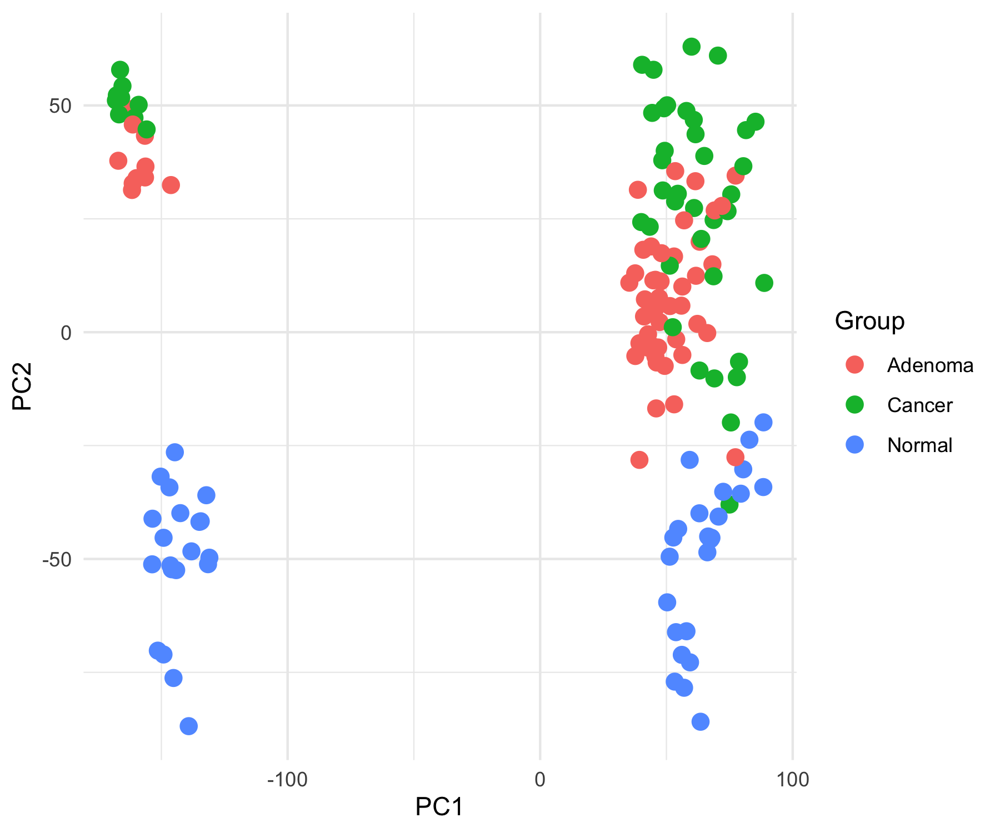
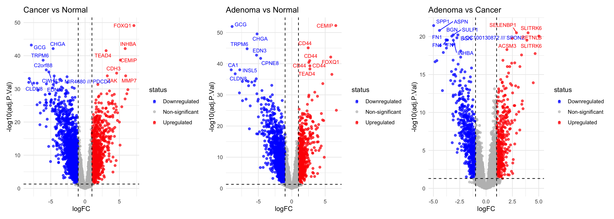
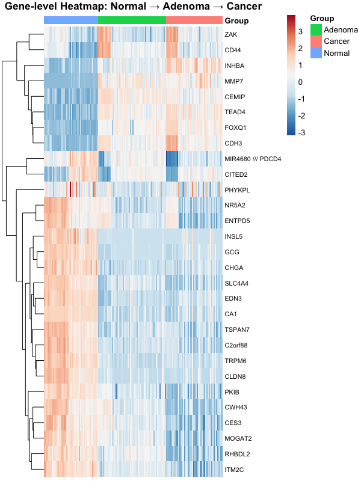
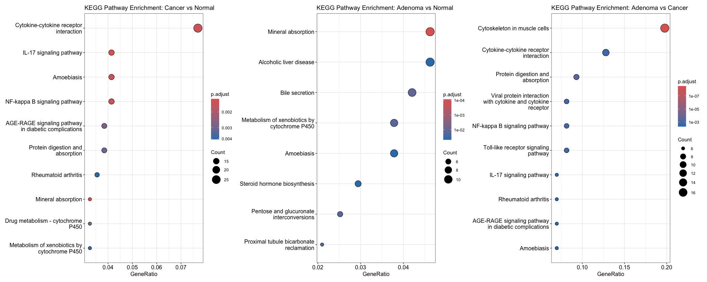

# Bulk Transcriptomics Analysis of Colorectal Cancer Progression (GSE20916)

## Project Overview

This project presents a bulk transcriptomic analysis of the public GEO dataset **GSE20916**, comparing gene expression profiles across **normal tissue, adenoma, and carcinoma samples**. The aim was to identify transcriptomic changes associated with colorectal cancer progression and interpret them using differential expression and pathway enrichment analysis.

Although the dataset is microarray-based, the workflow follows a classic bulk transcriptomics pipeline: quality assessment, dimensionality reduction, differential expression analysis, gene annotation, functional enrichment, and biological interpretation.

## Methods

The analysis was performed in **R** using Bioconductor and visualization packages.

Main steps included:

* Downloading and processing GEO expression data with `GEOquery`
* Sample grouping into Normal, Adenoma, and Cancer groups
* Quality control and exploratory analysis using PCA
* Differential expression analysis with `limma`
* Volcano plot visualization with upregulated, downregulated, and non-significant genes
* Probe-to-gene annotation and gene-level heatmap visualization
* GO Biological Process enrichment analysis using `clusterProfiler`
* KEGG pathway enrichment analysis
* Enrichment network visualization with `enrichplot`

## Tools and Packages

* R
* GEOquery
* limma
* ggplot2
* ggrepel
* pheatmap
* clusterProfiler
* enrichplot
* org.Hs.eg.db
* patchwork
* RColorBrewer

## Key Results

### Principal Component Analysis

PCA showed a clear transcriptomic separation between normal samples and disease-associated samples. Adenoma and carcinoma samples partially overlapped, which is biologically consistent with a progression model from normal tissue to adenoma and carcinoma.

### Differential Expression Analysis

Differential expression analysis identified strong gene expression changes in all comparisons:

* Cancer vs Normal
* Adenoma vs Normal
* Adenoma vs Cancer

Volcano plots highlighted both upregulated and downregulated genes. Several cancer-relevant genes appeared among the top differentially expressed genes, including markers related to extracellular matrix remodeling, epithelial changes, and tumor progression.

### Heatmap Analysis

The gene-level heatmap of top differentially expressed genes showed distinct expression patterns across Normal, Adenoma, and Cancer groups. Normal samples displayed a clearly different expression profile compared with adenoma and carcinoma samples, supporting the presence of strong disease-associated transcriptomic changes.

### Functional Enrichment

#### GO enrichment analysis highlighted biological processes related to:

* extracellular matrix organization
* connective tissue development
* hormone and metabolic processes
* metal ion and detoxification responses
* cell-substrate adhesion and tissue remodeling

#### KEGG enrichment identified pathways associated with:

* cytokine-cytokine receptor interaction
* IL-17 signaling
* NF-kappa B signaling
* protein digestion and absorption
* mineral absorption
* metabolism of xenobiotics by cytochrome P450

These results suggest involvement of inflammatory signaling, extracellular matrix remodeling, metabolic changes, and tissue organization during colorectal cancer progression.

## Visualizations

The repository includes:

* PCA plot
* Volcano plots with labeled top genes
* Gene-level heatmap
* GO Biological Process dotplots
* KEGG pathway enrichment dotplots
* GO enrichment network plot

## Interpretation

The results support a biologically meaningful progression pattern from normal tissue to adenoma and carcinoma. Normal samples form a distinct transcriptomic group, while adenoma and cancer samples show partially overlapping profiles. This suggests that adenoma already shares many molecular features with carcinoma, while still retaining distinct gene expression changes.

The enrichment results point toward extracellular matrix remodeling, inflammatory signaling, and metabolic pathway alterations as important biological processes in disease progression.

## Limitations

* The dataset is microarray-based rather than RNA-seq-based.
* Batch effects were not deeply modeled beyond exploratory PCA.
* The analysis is based on public data and would require additional validation in independent cohorts.
* Functional enrichment results are hypothesis-generating and should be interpreted biologically rather than as direct proof of pathway activity.

## Future Improvements

Possible extensions of this project include:

* adding batch-effect assessment and correction if needed
* performing separate enrichment analysis for upregulated and downregulated genes
* validating selected genes in an independent GEO or TCGA dataset
* adding survival analysis using external clinical datasets
* comparing results with known colorectal cancer marker genes

## Summary

This project demonstrates a complete bulk transcriptomics workflow in R, including data acquisition, preprocessing, differential expression analysis, visualization, functional enrichment, and biological interpretation. It is suitable as a portfolio project for bioinformatics, computational biology, or biomedical data science applications.
