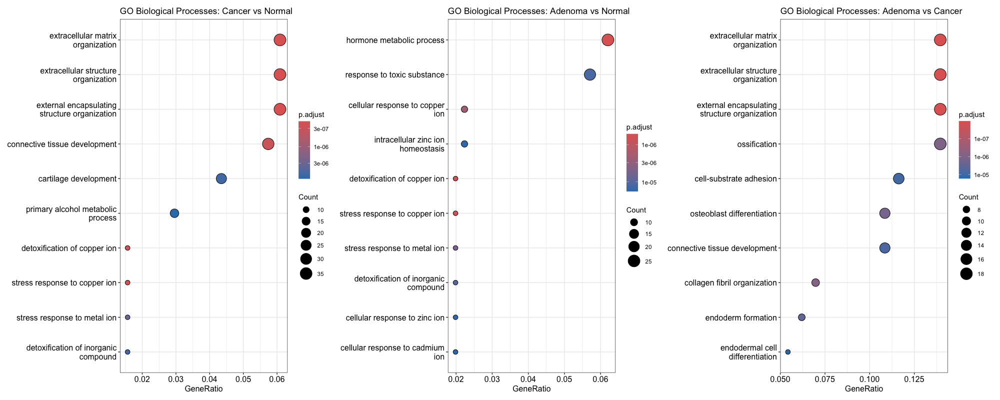

# Bulk-Transcriptomics-Analysis-of-Colorectal-Cancer-Progression-GSE20916-
This project presents a bulk transcriptomic analysis of the GEO dataset GSE20916 using R and Bioconductor packages. The analysis investigates transcriptomic differences between normal tissue, adenoma and carcinoma samples.

The workflow includes:
- GEO data acquisition
- Data preprocessing and quality control
- Principal Component Analysis (PCA)
- Differential gene expression analysis using LIMMA
- Volcano plot visualization
- Heatmap generation
- Functional enrichment analysis (GO and KEGG)
- Network visualization of enriched biological pathways

---

# Dataset

- **Source:** GEO (Gene Expression Omnibus)
- **Dataset ID:** GSE20916
- **Platform:** Microarray transcriptomic dataset
- **Biological context:** Adenoma-carcinoma progression in colorectal cancer

Dataset link:
[https://www.ncbi.nlm.nih.gov/geo/query/acc.cgi?acc=GSE20916](https://www.ncbi.nlm.nih.gov/geo/query/acc.cgi?acc=GSE20916)

---

# Tools and Libraries

## R packages used

```r
library(GEOquery)
library(ggplot2)
library(limma)
library(clusterProfiler)
library(enrichplot)
library(pheatmap)
library(RColorBrewer)
library(org.Hs.eg.db)
library(patchwork)
library(ggrepel)
```

---

# Workflow

## 1. Data Acquisition

- Downloaded expression data from GEO using GEOquery
- Extracted expression matrix and metadata
- Assigned biological groups:
    - Normal
    - Adenoma
    - Cancer

---

## 2. Quality Control and PCA

Principal Component Analysis (PCA) was performed to evaluate transcriptomic separation between biological groups.

### Observation

- Normal samples clustered separately from tumor samples
- Adenoma and carcinoma samples showed partial overlap
- Results suggest progressive transcriptomic changes during tumor development

---

## 3. Differential Expression Analysis

Differential expression analysis was performed using the LIMMA package.

### Comparisons
- Cancer vs Normal
- Adenoma vs Normal
- Adenoma vs Cancer

Genes were filtered based on:
- adjusted p-value < 0.05
- |logFC| > 1


PCA and Volcano plots


---

## 4. Volcano Plots
Volcano plots were generated to visualize significantly upregulated and downregulated genes.

### Key observations
- Cancer vs Normal showed the strongest transcriptomic differences
- Adenoma vs Cancer displayed fewer differentially expressed genes
- Results are consistent with biological progression from normal tissue to carcinoma

---

## 5. Heatmap Analysis
Top differentially expressed genes were visualized using a heatmap.


### Key observations
- Normal samples formed a distinct expression cluster
- Adenoma and carcinoma samples showed more similar expression profiles
- Several genes associated with colorectal cancer progression were identified:
    - MMP7
    - CD44
    - CLDN8
    - CHGA

---

## 6. Functional Enrichment Analysis
Gene Ontology (GO) and KEGG enrichment analyses were performed using clusterProfiler.

GO enrichment dotplots


KEGG pathway analysis


### Biological processes identified
Examples included:
- extracellular matrix organization
- cell proliferation
- signaling pathways associated with tumor progression
Network visualization was generated using enrichment maps.

---

# Results
PCA demonstrated progressive transcriptomic separation from normal tissue to adenoma and carcinoma.
Differential expression analysis identified strong dysregulation of extracellular matrix remodeling and hypoxia-associated genes.
KEGG enrichment highlighted cancer-associated pathways including p53 signaling, chemokine signaling, and tight junction remodeling.
GO analysis suggested activation of hypoxia response and fibroblast proliferation processes during tumor progression.
Overall, the results support the biological model of adenoma-to-carcinoma progression.

---

# Visualizations
The repository includes:
- PCA plot
- Volcano plots
- Heatmap
- GO enrichment dotplots
- KEGG pathway analysis
- Enrichment network plots

---

# Skills Demonstrated
This project demonstrates practical experience with:
- Bulk transcriptomics analysis
- GEO data retrieval
- Differential gene expression analysis
- LIMMA workflow
- Functional enrichment analysis
- Data visualization in R
- Biological interpretation of transcriptomic data

—

# Future Improvements
- Potential future extensions:
- Batch effect correction
- Additional normalization methods
- Integration with RNA-seq datasets
- Survival analysis
- Machine learning classification models
- Interactive visualizations

Author
Dominika Brosch
GitHub: [Your GitHub Profile] LinkedIn: [Your LinkedIn]
